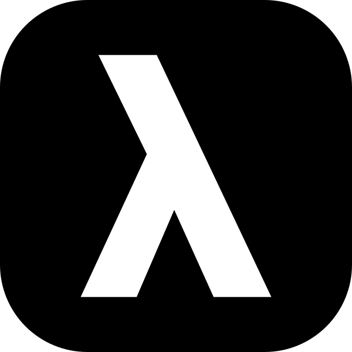

  

   
  

	<h1 align="center"><b>Voulr</b></h1>
	

        A Lambda platform for backend developers
     
    <a href="https://voulr.com"><strong>voulr.com »</strong></a>
     

Voulr is an open source Lambda platform written in rust.

## Architecture

-   `web`: A static site built with [Svelte](https://svelte.dev) and deployed to [Cloudflare Pages](https://pages.cloudflare.com).
-   `server`: A rust server built with [Axum](https://github.com/tokio-rs/axum) deployed to [AWS Lambda](https://aws.amazon.com/lambda).

## Credits

-   Design inspired by [Scale](https://scale.com) and [Stripe](https://stripe.com).
-   Idea inspired by [Cloudflare Pages](https://pages.cloudflare.com) and [Cargo Lambda](https://cargo-lambda.info).
